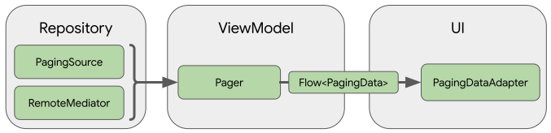
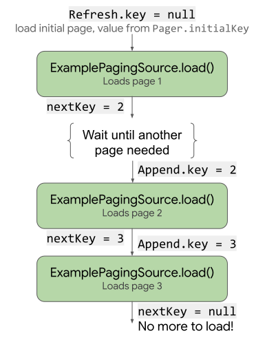

WanJetpack
==========

### 参考demo

- [Sunflower](https://github.com/android/sunflower)
- [architecture-components-samples](https://github.com/android/architecture-components-samples)
- [views-widgets-samples](https://github.com/android/views-widgets-samples)
- [user-interface-samples](https://github.com/android/user-interface-samples)
- [architecture-samples](https://github.com/android/architecture-samples)
- [compose-samples](https://github.com/android/compose-samples)： 本demo中暂时不涉及Compose功能

### 相关知识点

- [LiveData文档](https://developer.android.google.cn/topic/libraries/architecture/livedata)
    - [LiveDataSample](https://github.com/android/architecture-components-samples/tree/main/LiveDataSample):
    - 持有可被观察的类类似于**EventBus**或者**RxJava**。LiveData是一种可感知生命周期的组件
    - LiveData与MutableLiveData区别
    - [LiveData使用](https://www.jianshu.com/p/c69a7db3299a)
    - [理解协程、LiveData 和 Flow](https://mp.weixin.qq.com/s/p5H51RC6QfyyoAcQ1aGRLg)
    - [Google 推荐在 MVVM 架构中使用 Kotlin Flow](https://juejin.cn/post/6854573211930066951)
    - 关于Retrofit和LiveData相关参考demo：GithubBrowserSample[]

- [ViewModel文档](https://developer.android.google.cn/topic/libraries/architecture/viewmodel)
    - [ViewModel 四种集成方式](https://mp.weixin.qq.com/s/Hl8Yuf2bkDlVlgdB4M-wrw),即：
        - ViewModel 中的 Saved State —— 后台进程重启时，ViewModel 的数据恢复；
        - 在 NavGraph 中使用 ViewModel —— ViewModel 与导航 (Navigation) 组件库的集成；
        - ViewModel 配合数据绑定 (data-binding) —— 通过使用 ViewModel 和 LiveData 简化数据绑定；
        - viewModelScope —— Kotlin 协程与 ViewModel 的集成。
    - [在Activity或者Fragment中**如何处理ViewModel的三种方式**（没太懂）](https://juejin.cn/post/6854573211930066951)

- [ViewBinding文档](https://developer.android.google.cn/topic/libraries/view-binding)

- [DataBinding文档](https://developer.android.google.cn/topic/libraries/data-binding)
    - 取代findviewbyId，类似于**Butterknife**。

- [coroutines]()
    - [理解协程、LiveData 和 Flow](https://mp.weixin.qq.com/s/p5H51RC6QfyyoAcQ1aGRLg)
        - liveData 协程构造方法提供了一个协程代码块，这个块就是 LiveData 的作用域，**当 LiveData 被观察的时候，里面的操作就会被执行，当 LiveData 不再被使用时，里面的操作就会取消。** 而且该协程构造方法产生的是一个不可变的LiveData，可以直接暴露给对应的视图使用。而 emit() 方法则用来更新 LiveData 的数据。
        - 一个常见用例，比如当用户在 UI 中选中一些元素，然后将这些选中的内容显示出来。一个常见的做法是，把被选中的项目的 ID 保存在一个 MutableLiveData 里，然后运行 switchMap。现在在 switchMap 里，您也可以使用协程构造方法:
        ```kotlin
            private val itemId = MutableLiveData<String>()
            val result = itemId.switchMap {
                liveData { emit(fetchItem(it)) }
            }
        ```
    - [Google 推荐在 MVVM 架构中使用 Kotlin Flow](https://juejin.cn/post/6854573211930066951)
    - [图解协程原理](https://juejin.cn/post/6883652600462327821)

- [Hilt]()
    - hilt 和 **Koin**

- [Paging 库](https://developer.android.google.cn/jetpack/androidx/releases/paging) **3.0.0正式版**已发布，普天同庆！Paging 库可帮助您加载和显示来自本地存储或网络中更大的数据集中的数据页面。此方法可让您的应用更高效地利用网络带宽和系统资源。Paging 库的组件旨在契合推荐的 Android 应用架构，流畅集成其他 Jetpack 组件，并提供一流的 Kotlin 支持。
    - [官方文档](https://developer.android.google.cn/topic/libraries/architecture/paging/v3-overview)
    - 官方demo：
        - [PagingSample](https://github.com/android/architecture-components-samples/tree/main/PagingSample) ： 本地数据库的demo
        - [PagingWithNetworkSample](https://github.com/android/architecture-components-samples/tree/main/PagingWithNetworkSample) ： 网络数据的demo
    - Paging 库包含以下功能：
        - 分页数据的内存中缓存。该功能可确保您的应用在处理分页数据时高效利用系统资源。
        - 内置的请求重复信息删除功能，可确保您的应用高效利用网络带宽和系统资源。
        - 可配置的 RecyclerView 适配器，会在用户滚动到已加载数据的末尾时自动请求数据。
        - 对 Kotlin 协程和 Flow 以及 LiveData 和 RxJava 的一流支持。
        - 内置对错误处理功能的支持，包括刷新和重试功能。
    - Paging 组件及其在应用架构的集成：
        
    - 定义数据源 ： 数据源的定义取决于您从哪里加载数据。您仅需实现 PagingSource 或者 PagingSource 与 RemoteMediator 的组合:
        - 如果您从**单个源加载数据**，例如**网络**、**本地数据**、**文件**、**内存缓存**等（不只是网络和数据库，其他如文件也可以使用Paging），实现 PagingSource 即可，如果您使用了 Room，从 2.3.0-alpha 开始，它将默认为您实现 PagingSource。
        - 如果您从一个多层级数据源加载数据，就像带有本地数据库缓存的网络数据源那样。那么您需要实现 RemoteMediator 来合并两个数据源到一个本地数据库缓存的 PagingSource 中。
    - PagingSource ：
        - PagingSource 可以定义一个**分页数据的数据源**，以及从该数据源获取数据的方式。
        - LoadParams：PagingSource 的 密封类（sealed），包含有关要执行的加载操作的信息，其中包括要加载的键和要加载的项数。作为load()函数的参数使用
        - LoadResult：PagingSource 的 密封类（sealed），包含加载操作的结果。LoadResult 是一个密封的类，根据 load() 调用是否成功。作为load()函数的返回值
        - getRefreshKey()： 该方法接受 PagingState 对象作为参数，并且当数据在初始加载后刷新或失效时，该方法会返回要传递给 load() 方法的键。在后续刷新数据时，Paging 库会自动调用此方法。
        - load()： 下图说明了load() 函数如何接收每次加载的键并为后续加载提供键：
            
        - 代码示例：
            ```kotlin
                // 自定义PagingSource类
                private const val ARTICLE_STARTING_PAGE_INDEX = 0

                class HomeArticlePagingSource(
                    private val api: WanJetpackApi
                ) : PagingSource<Int, ApiArticle>() {

                    override suspend fun load(params: LoadParams<Int>): LoadResult<Int, ApiArticle> {
                        val page = params.key ?: ARTICLE_STARTING_PAGE_INDEX
                        return try {
                            val response = api.getHomeArticle(page)
                            val datas = response.data.datas
                            LoadResult.Page(
                                data = datas,
                                prevKey = if (page == ARTICLE_STARTING_PAGE_INDEX) null else page - 1,
                                nextKey = if (page == response.data.pageCount) null else page + 1,
                            )
                        } catch (exception: Exception) {
                            LoadResult.Error(exception)
                        }
                    }

                    override fun getRefreshKey(state: PagingState<Int, ApiArticle>): Int? {
                        return null
                    }
                }
            ```
    - PagingData ：
        - **分页数据的容器**被称为 PagingData，每次刷新数据时，都会创建一个 PagingData 的实例。如果要创建 PagingData 数据流，您需要创建一个 Pager 实例，并提供一个 PagingConfig 配置对象和一个可以告诉 Pager 如何获取您实现的 PagerSource 的实例的函数，以供 Pager 使用。
        - Pager 类提供的方法可显示来自 PagingSource 的 PagingData 对象的响应式流。Paging 库支持使用多种流类型，**包括** Flow、LiveData 以及 RxJava 中的 Flowable 和 Observable 类型。
        - 通过 Pager().flow可以返回Flow<PagingData<ApiArticle>>。然后在ViewModel中.cachedIn(viewModelScope)， cachedIn()运算符使数据流可共享，并使用提供的 CoroutineScope 缓存加载的数据
        - 代码示例： （注：Pager 的 remoteMediator 参数可选项， RemoteMediator 是重点）
            ```kotlin
                //Repository:
                fun getHomeArticle(): Flow<PagingData<ApiArticle>> {
                    return Pager(
                        config = PagingConfig(enablePlaceholders = false, pageSize = HOME_ARTICLE_PAGE_SIZE),
                        pagingSourceFactory = { HomeArticlePagingSource(api) }
                    ).flow
                }
            ```
            ```kotlin
                //ViewModel:
                fun getHomeArticle(): Flow<PagingData<ApiArticle>> {
                    val newResult: Flow<PagingData<ApiArticle>> =
                        repository.getHomeArticle().cachedIn(viewModelScope)
                    currentArticleResult = newResult
                    return newResult
                }
            ```
    - PagingDataAdapter ：
        - 与定义 RecyclerView 列表 Adapter 时的通常做法相同：必须定义 onCreateViewHolder() 和 onBindViewHolder() 方法；指定 ViewHoler 和 DiffUtil.ItemCallback
        - Adapter 及 UI （ Activity、Fragment ）中的相关代码略。
    - LoadType ： 是个 enum 类，包含三种状态：REFRESH、PREPEND、APPEND。在 PagingSource 的 LoadParams 类中用到。
        - 官方介绍：Type of load a [PagingData] can trigger a [PagingSource] to perform.
        - REFRESH：[PagingData] content being refreshed, which can be a result of [PagingSource] invalidation, refresh that may contain content updates, or the initial load.
        - PREPEND：Load at the start of a [PagingData].
        - APPEND：Load at the end of a [PagingData].
    - LoadState ： 是个 sealed（密封） 类。
        - 官方介绍：LoadState of a PagedList load - associated with a [LoadType].
        - [LoadState] of any [LoadType] may be observed for UI purposes by registering a listener via [androidx.paging.PagingDataAdapter.addLoadStateListener] or [androidx.paging.AsyncPagingDataDiffer.addLoadStateListener]
        - Paging 库通过 LoadState 对象公开可在界面中使用的加载状态。LoadState 根据当前的加载状态采用以下三种形式之一：
            - 如果没有正在执行的加载操作且没有错误，则 LoadState 为 LoadState.NotLoading 对象。
            - 如果有正在执行的加载操作，则 LoadState 为 LoadState.Loading 对象。
            - 如果出现错误，则 LoadState 为 LoadState.Error 对象。
    - 加载状态的三个场景：下拉刷新、上拉加载更多、首次进入页面中间的滚动条（及加载失败提醒）
    - **显示加载状态** ： 可通过两种方法在界面中使用 LoadState：使用**监听器**，以及使用**特殊的列表适配器**在 RecyclerView 列表中直接显示加载状态。
        - 方法一、 使用**监听器获取**加载状态： 为了获取加载状态以用于界面中的一般用途，PagingDataAdapter 中提供了 addLoadStateListener()、loadStateFlow 两种方式。来自 loadStateFlow 或 addLoadStateListener() 的更新可确保与界面的更新保持同步。这意味着，如果您收到 NotLoading.Incomplete 的 LoadState，则可以确定加载已完成，并且界面也已相应更新。
            ```kotlin
                // addLoadStateListener 方式。
                articleAdapter.addLoadStateListener {
                    when (it.refresh) {
                        is LoadState.NotLoading -> {
                            progressBar.visibility = View.INVISIBLE
                            recyclerView.visibility = View.VISIBLE
                        }
                        is LoadState.Loading -> {
                            progressBar.visibility = View.VISIBLE
                            recyclerView.visibility = View.INVISIBLE
                        }
                        is LoadState.Error -> {
                            val state = it.refresh as LoadState.Error
                            progressBar.visibility = View.INVISIBLE
                            Toast.makeText(this, "Load Error: ${state.error.message}", Toast.LENGTH_SHORT).show()
                        }
                    }
                }
            ```
            ```kotlin
                // loadStateFlow 方式
                // collectLatest 是个 suspend 函数，所以要在协程或者另一个 suspend 中调用
                lifecycleScope.launch {
                  pagingAdapter.loadStateFlow.collectLatest {
                    progressBar.isVisible = it.refresh is LoadState.Loading
                    retry.isVisible = it.refresh !is LoadState.Loading
                    errorMsg.isVisible = it.refresh is LoadState.Error
                  }
                }
            ```
        - 方法二、 使用**适配器呈现**加载状态： Paging 库提供了另一个名为 LoadStateAdapter 的列表适配器，用于直接在显示的分页数据列表中呈现加载状态。**其实该方法就是**在PagingDataAdapter中把addLoadStateListener()和ConcatAdapter封装了一下
            - 首先，创建一个实现 LoadStateAdapter 的类，并定义 onCreateViewHolder() 和 onBindViewHolder() 方法：
                ```kotlin
                    class LoadStateViewHolder(
                      parent: ViewGroup,
                      retry: () -> Unit
                    ) : RecyclerView.ViewHolder(
                      LayoutInflater.from(parent.context)
                        .inflate(R.layout.load_state_item, parent, false)
                    ) {
                      private val binding = LoadStateItemBinding.bind(itemView)
                      private val progressBar: ProgressBar = binding.progressBar
                      private val errorMsg: TextView = binding.errorMsg
                      private val retry: Button = binding.retryButton
                        .also {
                          it.setOnClickListener { retry() }
                        }

                      fun bind(loadState: LoadState) {
                        if (loadState is LoadState.Error) {
                          errorMsg.text = loadState.error.localizedMessage
                        }

                        progressBar.isVisible = loadState is LoadState.Loading
                        retry.isVisible = loadState is LoadState.Error
                        errorMsg.isVisible = loadState is LoadState.Error
                      }
                    }

                    // Adapter that displays a loading spinner when
                    // state = LoadState.Loading, and an error message and retry
                    // button when state is LoadState.Error.
                    class ExampleLoadStateAdapter(
                      private val retry: () -> Unit
                    ) : LoadStateAdapter<LoadStateViewHolder>() {

                      override fun onCreateViewHolder(
                        parent: ViewGroup,
                        loadState: LoadState
                      ) = LoadStateViewHolder(parent, retry)

                      override fun onBindViewHolder(
                        holder: LoadStateViewHolder,
                        loadState: LoadState
                      ) = holder.bind(loadState)
                    }
                ```
            - 然后，从 PagingDataAdapter 对象调用 withLoadStateHeaderAndFooter() 方法：
                ```kotlin
                    pagingAdapter
                      .withLoadStateHeaderAndFooter(
                        header = ExampleLoadStateAdapter(adapter::retry),
                        footer = ExampleLoadStateAdapter(adapter::retry)
                      )
                ```
            - 如果您只想让 RecyclerView 在页眉或页脚中显示加载状态，则可以调用 withLoadStateHeader() 或 withLoadStateFooter()。 关于withLoadStateHeaderAndFooter()、withLoadStateHeader() 和 withLoadStateFooter()的实现，通过源码发现，其实就是用的PagingDataAdapter.addLoadStateListener()方案，只不过是通过ConcatAdapter封装下。即：**在PagingDataAdapter中把addLoadStateListener()和ConcatAdapter封装了一下，且返回值是ConcatAdapter**
            - **注意**：由于withLoadStateHeaderAndFooter()、withLoadStateHeader() 和 withLoadStateFooter()返回的是ConcatAdapter，所以如果已经用构造函数ConcatAdapter(firstAdapter, articleAdapter)的话，再用withLoadState···添加页眉页脚会失败，因为用withLoadState···返回的也是ConcatAdapter就有两个ConcatAdapter了。**这个时候正确的做法是用withLoadState···创建ConcatAdapter，然后再用concatAdapter.addAdapter(0,firstAdapter)添加其它的adapter，且调用concatAdapter.addAdapter的位置在binding.articleList.adapter = concatAdapter前后都可以。**

    - Pager ： Pager().flow 把 PagingSource 转换为 PagingData。在Repository中用到
    - RemoteMediator ： 在Pager()中用到。
        - 当您从一个多层级数据源加载数据时，应当实现一个 RemoteMediator。
        - 一般用法为从网络请求数据并存入数据库。每当数据库中没有数据可以被展示时，就会触发 load() 方法。基于 **PagingState** 和 **LoadType**，我们可以构造下一页的数据请求。
    - PagingConfig ： 在Pager()中用到
    - PagingState ： 在自定义 PagingSource 的 getRefreshKey()方法中用到，在自定义RemoteMediator的load()方法中也用到了。
        - 官方介绍：Snapshot state of Paging system including the loaded [pages], the last accessed [anchorPosition], and the [config] used.

    - 参考博客：目前Paging已经发布3.0正式版，下面这个博客是alpha版本的，但可以参考：
        - [使用 Paging 3 实现分页加载](https://mp.weixin.qq.com/s/_eUYkmjIQKRugd29wE2w0g)
        - [Jetpack 系列之Paging3，看这一篇就够了~](https://huanglinqing.blog.csdn.net/article/details/109696431)

- [Room 库](https://developer.android.google.cn/topic/libraries/architecture/room?hl=zh_cn)
    - [官方指南](https://developer.android.google.cn/training/data-storage/room?hl=zh_cn)
    - [官方 demo](略)

- [DataStore]()
    - [使用 Jetpack DataStore 进行数据存储](https://mp.weixin.qq.com/s/26Uxotf3-oceKUbrujqX3w)

- [App Startup]()

- [WorkManager]()

- [compose]()

- [Navigation文档](https://developer.android.google.cn/guide/navigation)
    - [NavigationAdvancedSample](https://github.com/android/architecture-components-samples/tree/main/NavigationAdvancedSample)
    - 和路由框架**ARouter**的区别：ARouter主要是用于Activity路由的框架，采用的是APT技术，可用于组件化改造。而Navigation主要是用于Fragment路由导航的框架。
    - [Jetpack 之 Navigation 全面剖析](https://mp.weixin.qq.com/s/qgNbxgB-6qrFzJflqaBUdg)
    - [底部导航栏1](https://www.jianshu.com/p/8ec9f0185777)
    - [底部导航栏2](https://www.jianshu.com/p/729375b932fe)
    - **用户登录场景**
        - [条件导航](https://developer.android.google.cn/guide/navigation/navigation-conditional)
        - [Fragment 间用 activityViewModels() 共享数据](https://developer.android.google.cn/topic/libraries/architecture/viewmodel)
        - [在 NavGraph 中使用 ViewModel 共享数据](https://mp.weixin.qq.com/s/Hl8Yuf2bkDlVlgdB4M-wrw)
    - [Safe Args 导航](https://developer.android.google.cn/guide/navigation/navigation-pass-data)
    - Fragment间转场动画：[Android Material 组件 1.2.0 现已发布](https://mp.weixin.qq.com/s/PZD8RxrqP7_RAjXIo345aQ)

- [Preference 库](https://developer.android.google.cn/jetpack/androidx/releases/preference?hl=zh_cn)
    - [官方指南](https://developer.android.google.cn/guide/topics/ui/settings?hl=zh_cn)
    - 官方demo：[PreferencesKotlin](https://github.com/android/user-interface-samples/tree/master/PreferencesKotlin)

- [RecyclerView 库](https://developer.android.google.cn/jetpack/androidx/releases/recyclerview?hl=zh_cn)
    - [官方文档](https://developer.android.google.cn/guide/topics/ui/layout/recyclerview?hl=zh_cn)
    - [官方demo](https://github.com/android/views-widgets-samples/tree/main/RecyclerView)
        - RecyclerView： java版本普通demo
        - RecyclerViewAnimations： 新增、删除、更新 item的demo
        - RecyclerViewKotlin： ConcatAdapter的demo
            - 实现了ConcatAdapter，**能规避嵌套滑动**
            - [用Kotlin高阶函数处理 RecyclerView 中的点击事件](https://mp.weixin.qq.com/s/xtYtmn2zPRFcM4-uTVW3HA)
            - 实现了新增、删除item的方案及更新item动画
        - RecyclerViewSimple： kotlin版本普通demo
    - 默认的adapter：**RecyclerView.Adapter**：[认识 RecyclerView](https://zhuanlan.zhihu.com/p/363343211)
    - **ListAdapter**：继承RecyclerView.Adapter：[在 RecyclerView 中使用 ListAdapter](https://mp.weixin.qq.com/s/WZi3cemT4bfrKfDIpjFdbg)
    - **ConcatAdapter**：
        - [使用 ConcatAdapter 顺序连接其他 Adapter](https://mp.weixin.qq.com/s/ppmokK3__Qx1S1cMU8y7Tg)、 [在 RecyclerView 中使用 header 快人一步](https://mp.weixin.qq.com/s/-_9JOG27-XUQzMW5vSVjlA)、 [新技术系列：RecyclerView 的新伙伴 ConcatAdapter](https://mp.weixin.qq.com/s/QTaz45aLucX9mivVMbCZPQ)
        - [RecyclerView 的新伙伴 ConcatAdapter](https://mp.weixin.qq.com/s/QTaz45aLucX9mivVMbCZPQ),**待研究**。
    - **PagingDataAdapter**：继承RecyclerView.Adapter

- [滑动刷新]()： 一般滑动刷新用于RecyclerView中的下拉刷新和上拉加载更多。
    - [官方文档](https://developer.android.google.cn/training/swipe)
    - 官方demo：
        - [SwipeRefreshLayoutBasic](https://github.com/android/views-widgets-samples/tree/master/SwipeRefreshLayoutBasic)
        - [SwipeRefreshMultipleViews](https://github.com/android/views-widgets-samples/tree/master/SwipeRefreshMultipleViews)
    - 滑动刷新**界面**实现方案：
        - 三方框架：[SmartRefreshLayout](https://github.com/scwang90/SmartRefreshLayout)
        - 自己实现有三种方案：
            - **方案一**： 可以在RecyclerView外层自定义一个布局，里面放三个控件：HeaderView、RecyclerView、FooterView。 结合SwipeRefreshLayout的话，只需要写个FooterView就行了。[Android 简单易上手的下拉刷新控件](https://www.jianshu.com/p/459e611c0f62)、[Android RecyclerView下拉刷新 & 上拉加载更多](https://www.jianshu.com/p/b502c5b59998)
            - **方案二**： 可以作为RecyclerView的两个item处理，通过不同的Type类型区分
            - **方案三**： 可以通过ConcatAdapter配置：[使用 ConcatAdapter 顺序连接其他 Adapter](https://mp.weixin.qq.com/s/ppmokK3__Qx1S1cMU8y7Tg)
            - **方案四**： 可以直接用 PagingDataAdapter.withLoadStateFooter()加载页脚，但是下拉刷新还要自己实现。查询PagingDataAdapter中的实现方式发现，其实该方法也就**是方案三**，只是在PagingDataAdapter中已经封装好了。
            - 关于下拉刷新，还可以利用左滑删除的思想实现，但是体验不是特别理想，暂时pass该方案
    - 滑动刷新**功能**实现方案：
        - 如果是 ConcatAdapter、PagingDataAdapter ： 即用了 Paging3 ，相关说明参考上面的**Paging 库**说明。
        - 如果是 ListAdapter 、 RecyclerView.Adapter：
        - 下拉刷新、左滑删除参考demo：
            - [AndroidSwipeLayout](https://github.com/daimajia/AndroidSwipeLayout)
            - [SwipeRecyclerView](https://github.com/yanzhenjie/SwipeRecyclerView)
            - [Android 简单易上手的下拉刷新控件](https://www.jianshu.com/p/459e611c0f62)
- 加载状态的几个场景：下拉刷新、上拉加载更多、底部的已加载全部内容、首次进入页面的加载状态（及加载失败提醒）
    - 下拉刷新、上拉加载更多：略
    - 首次进入页面的加载状态：
    - 底部的已加载全部内容：方案比较多，个人比较倾向下面两种方案
        - 方案一：通过withLoadStateFooter实现，和上拉加载更多用同一套布局，同一个adapter。【参考本demo】
        - 方案二：通过ConcatAdapter.addAdapter实现，专门显示加载更多

- Animation 动画： 下拉刷新场景通过属性动画实现
    - [官方文档](https://developer.android.google.cn/training/animation)
    - [属性动画](https://developer.android.google.cn/guide/topics/graphics/prop-animation)：
        - ValueAnimator： 属性动画的主计时引擎，它也可计算要添加动画效果的属性的值。它具有计算动画值所需的所有核心功能，同时包含每个动画的计时详情、有关动画是否重复播放的信息、用于接收更新事件的监听器以及设置待评估自定义类型的功能。为属性添加动画效果分为两个步骤：计算添加动画效果之后的值，以及对要添加动画效果的对象和属性设置这些值。ValueAnimator 不会执行第二个步骤，因此，您必须监听由 ValueAnimator 计算的值的更新情况，并使用您自己的逻辑修改要添加动画效果的对象。如需了解详情，请参阅使用 ValueAnimator 添加动画效果部分。
        - ObjectAnimator： ValueAnimator 的子类，用于设置目标对象和对象属性以添加动画效果。此类会在计算出动画的新值后相应地更新属性。在大多数情况下，您不妨使用 ObjectAnimator，因为它可以极大地简化对目标对象的值添加动画效果这一过程。不过，有时您需要直接使用 ValueAnimator，因为 ObjectAnimator 存在其他一些限制，例如要求目标对象具有特定的访问器方法。
        - AnimationSet： 此类提供一种将动画分组在一起的机制，以使它们彼此相对运行。您可以将动画设置为一起播放、按顺序播放或者在指定的延迟时间后播放。如需了解详情，请参阅使用 AnimatorSet 编排多个动画部分。
        - LayoutTransition：
        - LayoutAnimations：

- [ViewPager2 库](https://developer.android.google.cn/jetpack/androidx/releases/viewpager2)
    - [官方文档](https://developer.android.google.cn/guide/navigation/navigation-swipe-view-2)
    - [官方demo](https://github.com/android/views-widgets-samples/tree/main/ViewPager2)
        - 官方demo中的ViewPager2 with a Preview of Next/Prev Page 相当于Banner中类似的场景
        - 官方demo中的ViewPager2 with a Nested RecyclerViews 场景很好，**提供了解决嵌套滑动的方案**
    - ViewPager2 **底层使用 RecycleView 实现的**，所以这里不再使用 PagerAdapter 而是使用了 **RecyclerView.Adapter**
    - 对应的fragment用的是 **FragmentStateAdapter**，而不是 FragmentStatePagerAdapter、FragmentPagerAdapter之类的


- Banner：其实就是 ViewPager 的应用
    - 三方库：
        - [banner](https://github.com/youth5201314/banner)
        - [开发一款商业级Banner控件](https://mp.weixin.qq.com/s/X615qrAXzVXVlsYtmXTj1w)
        - [打造一个灵活易用的Banner组件](https://mp.weixin.qq.com/s/b2_NB8ue0gvKZ2lvHITbNA)
        - [ViewPager2：打造Banner控件](https://juejin.cn/post/6844904066011643911)
    - 自己实现方案：
        - 让Banner和RecyclerView分开： 通过NestedScrollView里包裹ViewPager2和RecyclerView的话，会有滑动卡顿的问题，即使加上android:nestedScrollingEnabled="false"属性，除非再加上setHasFixedSize(true)，但是还会有其他的问题：加上setHasFixedSize(true)后，界面的数据只显示一页了。故此方案暂时行不通了。本方案相关代码
            ```kotlin
                binding.articleList.setHasFixedSize(true)
                binding.articleList.isNestedScrollingEnabled = false
            ```
        - 让Banner成为RecyclerView的一部分：
            - 如果Banner在顶部：banner在顶部的话，就做header
            - 如果Banner在中间：在中间的话，就type，或者对adapter做一个扩展，做一个可以在中间插入的类似header。毕竟type的话，写起来也蛮麻烦的
        - 通过 ConcatAdapter 实现：
            - 本demo就是用的该方案，demo中通过HomeFirstAdapter添加RecyclerView的ConcatAdapter中，通过HomeBannerAdapter实现ViewPager2的adapter。
            - 通过上述的方式加上ViewPager2之后，ViewPager2没有影响RecyclerView的功能，RecyclerView上下滑动流畅；但是ViewPager2不能滑动，因为事件被RecyclerView拦截了。故需新增自定义布局 NestedFrameLayout 嵌套在ViewPager2之上，在 NestedFrameLayout 去处理父类的事件分发，即当左右滑动 NestedFrameLayout 时，执行 NestedFrameLayout 的parent.requestDisallowInterceptTouchEvent(true)方法，让ViewPager2消费事件。
        - 通过 MultiTypeAdapter 实现：暂时没有验证
        - **工行融e购**实现方案：首页除了viewpager功能都放在AppBarLayout里面，但是这样TabLayout可能就要和融e购一样放在下面了，不是想要的。用ConcatAdapter也可以实现工行融e购的首页效果。
        - **京东首页**实现方案：自定义控件实现。用ConcatAdapter也能实现京东首页效果
- NestedScrollView
    - 直接在 NestedScrollView 中放入 ViewPager2 和 RecyclerView 时，会出现滑动卡顿。[解决方案参考](https://www.jianshu.com/p/8dd1e902b7cd)
    - [NestedScrollView](https://www.jianshu.com/p/f55abc60a879)
    - 事件冲突的原因：Android 的事件分发机制中，只要有一个控件消费了事件，其他控件就没办法再接收到这个事件了。因此，当有嵌套滑动场景时，我们都需要自己手动解决事件冲突。而在 Android 5.0 Lollipop 之后，Google 官方通过 嵌套滑动机制 解决了传统 Android 事件分发无法共享事件这个问题。
    - 嵌套滑动机制：嵌套滑动机制 的基本原理可以认为是事件共享，即当子控件接收到滑动事件，准备要滑动时，会先通知父控件(startNestedScroll）；然后在滑动之前，会先询问父控件是否要滑动（dispatchNestedPreScroll)；如果父控件响应该事件进行了滑动，那么就会通知子控件它具体消耗了多少滑动距离；然后交由子控件处理剩余的滑动距离；最后子控件滑动结束后，如果滑动距离还有剩余，就会再问一下父控件是否需要在继续滑动剩下的距离（dispatchNestedScroll)...


- [TabLayout]()
    - 和ViewPager2、Fragment应用

- [BottomNavigationView]()
    - 和Navigation、Fragment、ViewPager2应用

- [Constraint Layout]()
    [Constraint Layout 2.0 用法详解](https://mp.weixin.qq.com/s/7wEr6okR-CAAoNDYB4gHig)

- [CoordinatorLayout、NestedScrollView、CollapsingToolbarLayout、AppBarLayout、MaterialToolbart]()

- 待优化场景，搜索场景：[search](https://developer.android.google.cn/guide/topics/search)在 Android 系统的协助下使用**搜索对话框**或**搜索微件**传递搜索查询
    - 搜索对话框
    - 搜索微件

- Glide
    - 和Coil对比，建议换成Coil加载图片

- Cookie
    - [CookieManager](https://developer.android.google.cn/reference/kotlin/android/webkit/CookieManager)
    - 本demo中，和收藏相关都需要登录操作，建议登录将返回的cookie（其中包含账号、密码）持久化到本地即可。

- [Webview 库](https://developer.android.google.cn/jetpack/androidx/releases/webkit)
    - [官方文档](https://developer.android.google.cn/guide/webapps/webview)
    - [官方demo](https://github.com/android/views-widgets-samples/tree/main/WebView)
    - 本demo中跳转到WebFragment是通过 Bundle 传递参数，**没有**用通过 Navigation 的 Safe Args 导航实现
    - 本demo中的WebView适配了深色主题。

- 启动界面：（在Android10上调试）
    - 冷启动、热启动
    - Splash Screen：展示品牌Logo或Slogan
        - 如果只是单纯的显示个界面，只需要在themes里设置<item name="android:windowSplashscreenContent">@color/jetpack_green_500</item>即可。
    - Advertisement Screen：展示节日活动或日常广告
    - Guide Screen：演示重点功能，一般只展示一次
    - 参考博客：[Android 12上全新的应用启动API，适配一下？](https://mp.weixin.qq.com/s/Gd_iGSIlxbDhf7CHeik6GQ)

- **样式系统**和**沉侵模式**：（在Android10上调试）
    - 本demo沉侵式方案。关键属性：windowTranslucentStatus、statusBarColor、fitsSystemWindows、mSemiTransparentBarColor、clipToPadding
        1. 在themes中设置（或者通过代码设置） <item name="android:windowTranslucentStatus">true</item>。调试发现不设置 <item name="android:statusBarColor">@android:color/transparent</item> 也行。
        2. 在布局中设置（或者通过代码设置） AppBarLayout 的属性 android:fitsSystemWindows="true"，是为了防止AppBarLayout显示在statusbar上。
        2. 通过反射设置 decorView 的 mSemiTransparentBarColor 为透明即可。代码如下：
        ```kotlin
            try {
                val decorView = window.decorView::class.java
                val field = decorView.getDeclaredField("mSemiTransparentBarColor")
                field.isAccessible = true
                field.setInt(window.decorView, Color.TRANSPARENT)
            } catch (e: Exception) {
            }
        ```
    - 注意：statusbar 和 navigationbar 道理一样
    - 参考文章：
        - [Android 样式系统 | 主题背景和样式](https://mp.weixin.qq.com/s/07rXV6kTG5Sw06MH27Flyg)
        - [Android 样式系统 | **常见的主题背景属性**](https://mp.weixin.qq.com/s/bPIXbaqr2-6Huyr_h8S62g)
        - [Android 样式系统 | 主题背景属性](https://mp.weixin.qq.com/s/mygXtqPKag_2k3G_r_13_g)
        - [手势导航 (一) | 开启全面屏体验](https://mp.weixin.qq.com/s/DEI4bcmKkRBySUjO2AYEJA)
        - [手势导航 (二) | 处理视觉冲突](https://mp.weixin.qq.com/s/p_9Px7BH6DQGNYNqzPCWtw)
        - [手势导航 (三) | 如何处理手势冲突](https://mp.weixin.qq.com/s/M-lA6DADpgcoMqpnn9zV5g)
        - [手势导航 (四) | **沉浸模式**](https://mp.weixin.qq.com/s/8CpQOqulwh5AZO7LwMt87A)
        - [Android沉浸式状态栏，看完这篇就够了！](https://blog.csdn.net/qq_34681580/article/details/103955191)

- 触摸手势
    - [手势导航文档](https://developer.android.google.cn/training/gestures/gesturenav)
    - [拖动和缩放文档](https://developer.android.google.cn/training/gestures/scale)
